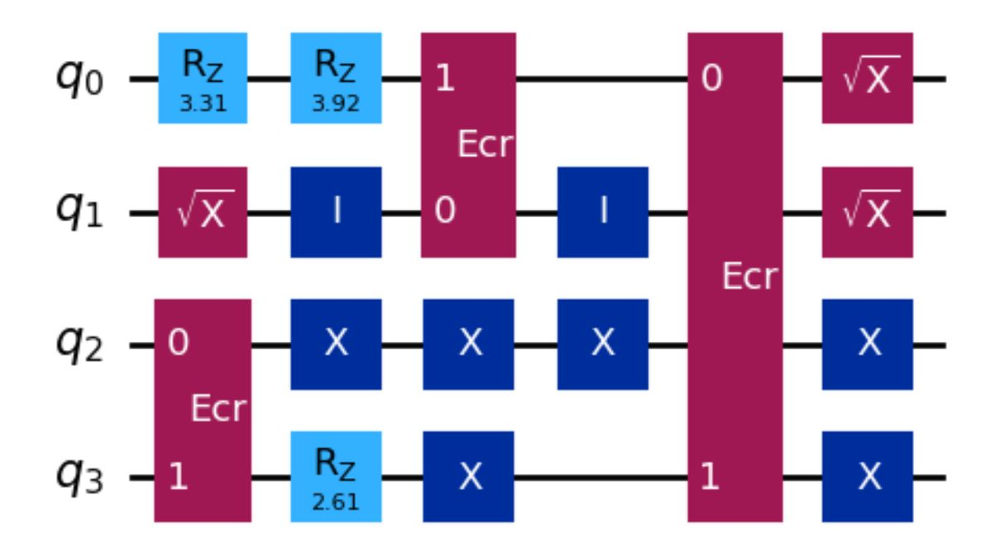
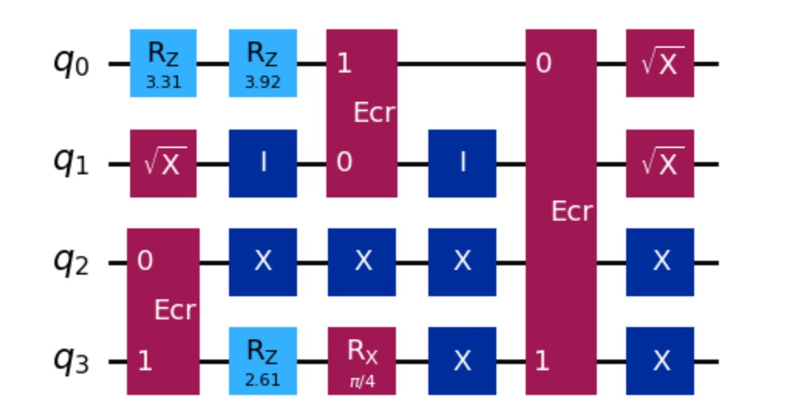
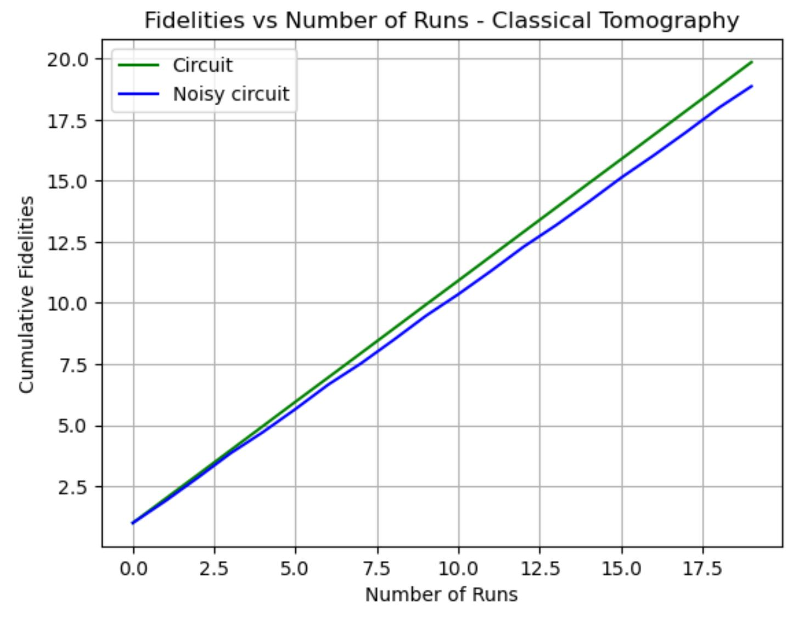
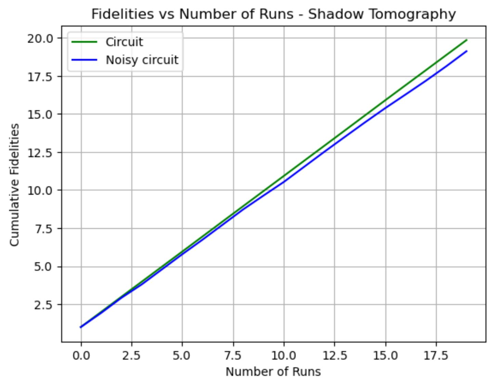
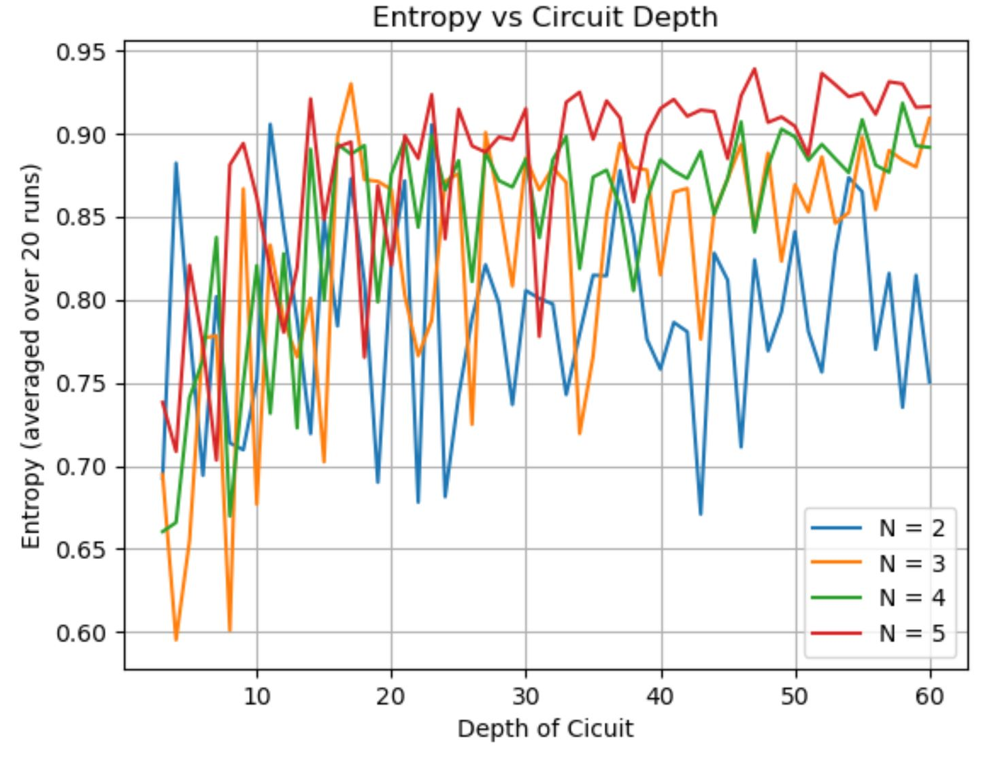
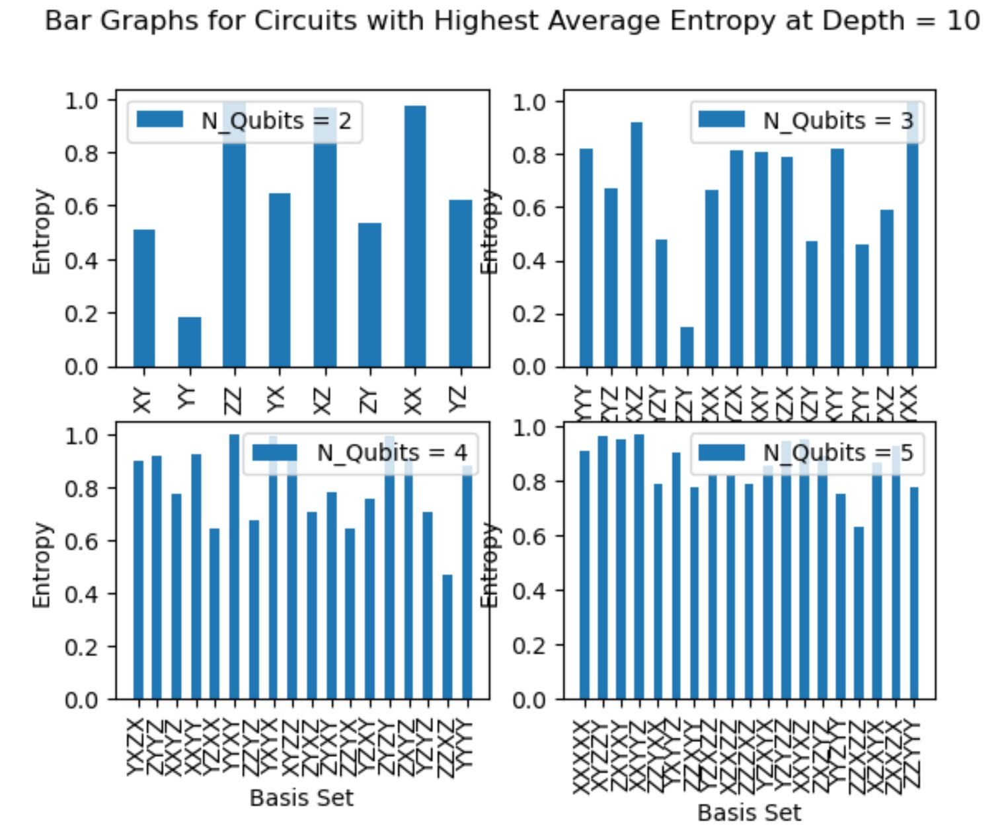
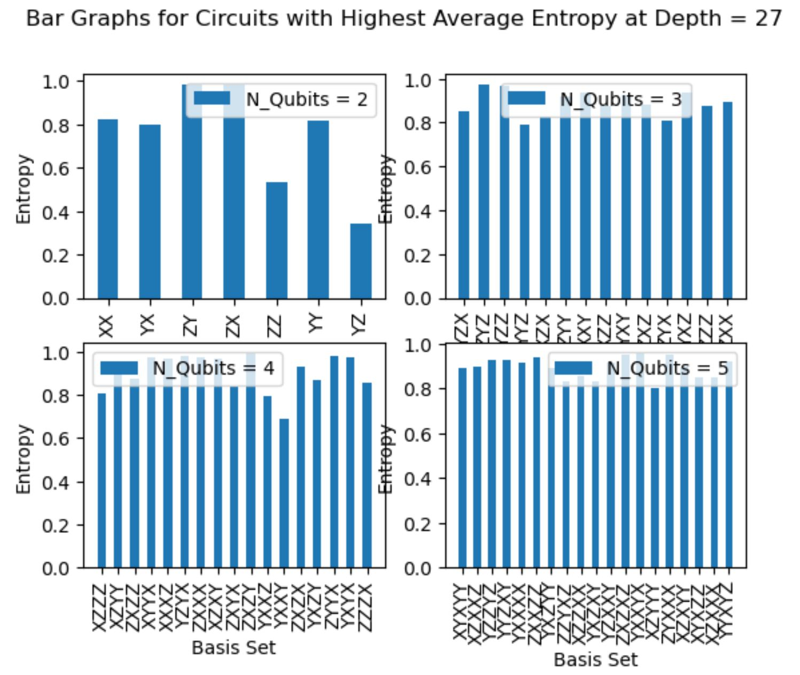

# Analysis of Measurement Outcomes to Study Random Quantum Circuits

**Authors:** Pranavi Jain, Dr. Marcin Abram

**Affiliation:** University of Southern California

---

## Table of Contents

- [Overview](#overview)
- [Project Description](#project-description)
- [Results](#results)

## Overview
This repository contains a collection of Jupyter notebooks that delve into analyzing measurement outcomes of random quantum circuits. The main focus is investigating various properties and characteristics of random quantum circuits. One of the key objectives is to discern differences between an ideal quantum circuit and its "noisy" counterpart, with potential applications in quantum computing and error correction.

This project uses Qiskit to generate and execute quantum circuits on IBM quantum hardware.

## Project Description

### Notebooks

1. **`Fidelity_for_Random_QCircuit.ipynb`**
   - **Objective:** To compare fidelity of outcomes of an ideal vs. noisy quantum circuit
   - **Key Features:**
     - Methods to generate random quantum circuits with given set of gates.
     - Method to add arbitrary noise to given circuit.
     - Performing 'n' runs of shadow tomography and classical tomography.
     - Visual comparison of fidelity for the two (ideal vs. noisy) circuits.
     - Visual comparison of fidelity for both classical and shadow tomography

2. **`Entropy.ipynb`**
   - **Objective:** To analyze entropy of a random circuit at different depths for different number of qubits.
   - **Key Features:**
     - Methods to generate random circuits with different depths and number of qubits. 
     - Methods to compute entropy for all circuits.
     - Visualization of trends in entropy with increasing circuit depth.

## Results

### Random Circuit Generation
- Successfully generated ***random quantum circuits*** for given number of qubits, depth, and set of quantum gates. 
 
Example of a random quantum circuit generated for N=4 and depth=5:

  

- Added ***arbitrary noise*** (here at position 3) to the circuit generated above:

  

### Fidelity Analysis
1. **Fidelity Comparison of Result from Classical Tomography:**

  

2. **Fidelity Comparison of Result from Shadow Tomography:**

  

### Entropy Analysis
1. **Entropy Trends for Quantum Circuits with Different Depth:**

  

2. **Bar Graphs for Measurement Outcomes of Circuits with Highest Entropy:**

  
  

---
